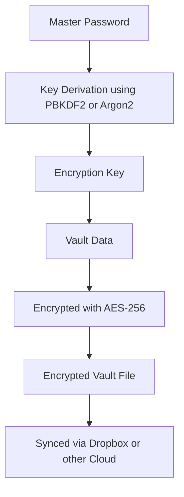

# ClavisPass

**Take control of your passwords – securely and seamlessly.**  
ClavisPass is a modern, privacy-focused password manager that works *with your own cloud*. Use Dropbox (or any other file-based sync) to securely manage your encrypted vault across all your devices.

---

## Features

- **Local Encryption Only**  
  Your data is encrypted on your device — it never leaves your hands unprotected.

- **Sync with Your Cloud**  
  Use Dropbox (or any cloud provider) to sync your vault privately without a centralized server.

- **Cross-Platform**  
  Available for **Linux, Windows, macOS, iOS**, and **Android** – one experience across all devices.

- **Simple & Focused Design**  
  No bloat, just what you need to manage your credentials — clean, fast, and minimal.

---

## Platforms

| Platform | Status |
|---------|--------|
| 🖥️ Windows | ✅ Released |
| 🐧 Linux   | ✅ Released |
| 🍎 macOS   | ✅ Released |
| 📱 Android | 🚧 Coming soon |
| 📱 iOS     | 🚧 Coming soon |

---

## Installation

### Desktop

Download the latest release for your platform from the [Releases Page](https://github.com/ClavisPass/ClavisPass/releases).

### Mobile

> *Coming soon via Expo and app stores*

---

## Security

ClavisPass encrypts your data using modern cryptographic standards (AES-256).  
Only you hold the key – no servers, no tracking, no compromise.

You can even inspect the source code or build it yourself!

---

## Screenshots

> *(Insert screenshots or a GIF of your app here to make the project visually appealing)*

---

## Tech Stack

### Frontend
- [React Native](https://reactnative.dev/) via [Expo](https://docs.expo.dev/versions/latest/)
- [react native paper](https://callstack.github.io/react-native-paper/docs/)
- [material design icons](https://pictogrammers.com/library/mdi/)

### Backend / Plattform
- [Tauri](https://tauri.app/) – safe Desktop-Framework with Rust
- [Rust](https://www.rust-lang.org/) – for native Performance & Encryption
- [Dropbox API](https://www.dropbox.com/developers) – as Cloud-Synchronisation

### Security
- AES-256 encryption
- Local key management – no external servers involved

### CI / CD & Deployment
- GitHub Actions – automated builds, code signing, and release uploads
- Expo OTA Updates – over-the-air updates for mobile platforms
- GitHub Pages – hosts the homepage and automatically serves the `updater.json`

## FAQ

> See the [FAQ section on the homepage](https://clavispass.github.io/ClavisPass/) or the bottom of this README for common questions and answers.

---

## License

This project is licensed under the MIT License – see the [LICENSE](LICENSE) file for details.

---

## Homepage

[https://clavispass.github.io/ClavisPass/](https://clavispass.github.io/ClavisPass/)